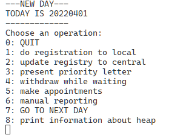
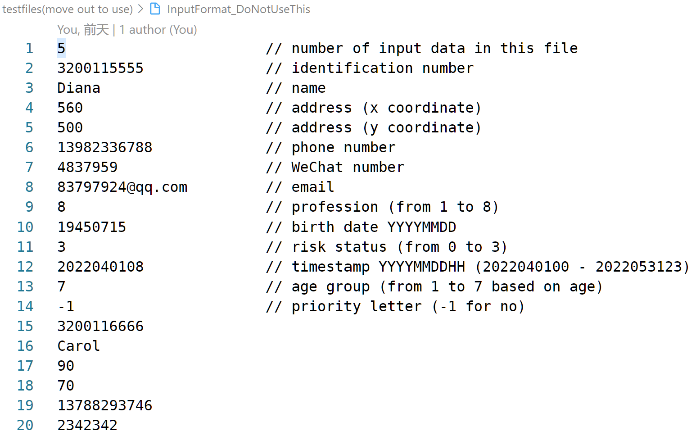
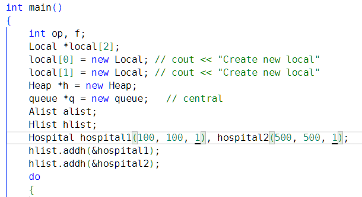

# Introduction

This project is a system that includes **registration, queueing and reporting**.

The core data structure is a Fibonacii heap to arrange patients based on different priorities. Data of patients are stored as a single-linked list.

# Instruction
## To compile

There is a *makefile* you can use:
- `make` to compile the program
- `make clean` to clean executable files produced

## To use

If you have the executable file *test*, you can run it.

The interface you will see looks like this:

Here, you can type in number to choose the operation.

### basic

Type in `0` to quit.
Type in `7` to go to next day.

### registration

1. Put registration data of patients in a file under the same directory as the program. You need to follow the input format as shown.

2. In the interface, type in `1` and follow the instructions shown. You can designate which local registry(1/2) these data will go to.
3. To collect data to central registry, type in `2`. This system automatically collects all data from all local registries.
*One person only has one data. If this person update his/her information, data before will be updated(overwritted)*

### queueing

Queueing is performed when they are added to central registry(when you type in `2`).

#### present priority letter

Type in `3`, follow the instruction to type in ID and a deadline.
#### withdraw while queueing

Type in `4`, follow the instruction to type in ID.
#### appointment

Type in `5`, this system will make appointments for queueing people.
*Note: To set the daily capacity of each hospital, you can change the underlined parameters in main.cpp as shown.*

### reporting

1. Reports are produced in *report* folder.
2. `Open_file()` is used to produce a week report, while `Month()` is used to produce a month report. All other functions in Report.h need not use in main function.
3. Our Report system uses data from a single-linked list that goes through all nodes.
4. By using sort(), we can order the reporting order as you wish.

#### manual

Type in `6`, follow the instruction to produce report.
*Note: don't do this on the first day!*

#### automatic

Based on date, this system will automatically make weekly or monthly report.

