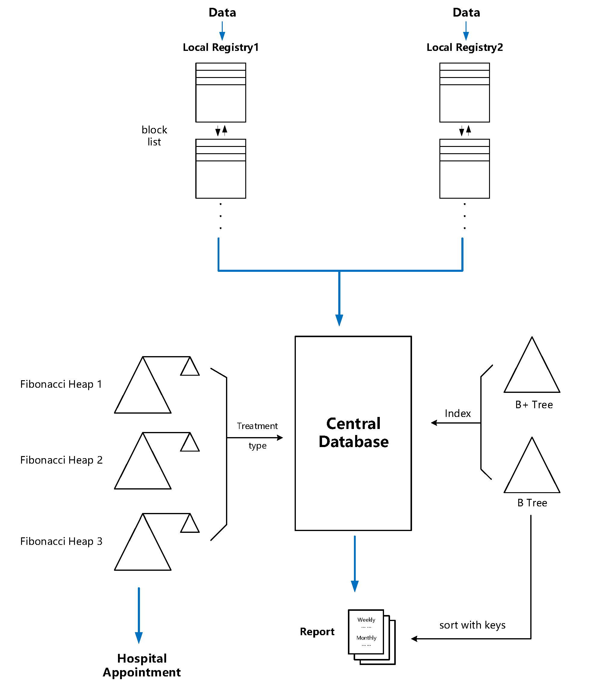
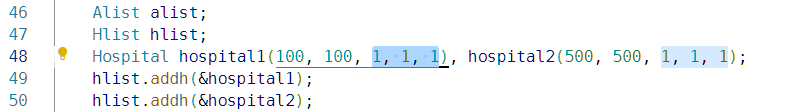

# Overview

This project is a system for mass medical treatment that includes **registration, queuing and reporting** operations.

The basic data structures are a **Fibonacci heap** to arrange patients based on different priorities, **B+ tree** to organize data block access based on ID and **B tree** to access data with a different key.

Patient information resides in external storage, thus arranged in **blocks**.

# Instruction

## To compile

There is a _Makefile_ you can use:

- `make` to compile the program
- `make clean` to clean executable files produced

## To use

If you have the executable file _main_, you can run it.

The interface you will see looks like this:

Here, you can type in number to choose the operation.

### Basic

Type in `0` to quit.
Type in `7` to go to next day.

### Registration

1. Put registration data of patients in a file under the same directory as the program. You need to follow the input format as shown.

_Note: Here **risk status = 2** is interpreted that this people will have the same priority as other people with risk status 0/1 after 30 days, if the system needs to judge priority based on risk status._

2. In the interface, type in `1` and follow the instructions shown. You can designate which local registry(1/2) these data will go to.

3. To collect data to central registry, type in `2`. This system automatically collects all data from all local registries.
   _One person only has one data. If this person update his/her information, data before will be updated(overwritten)_

### Queue

Queuing is performed when they are added to central registry(when you type in `2`). At the same time, data would be organized by B tree and
B+ tree based on selected key.
_Note: two week penalty is **added to the timestamp** when judging priority, which means it could be ignored if the priority can be judged by more important criteria like profession._

#### Present priority letter

Type in `3`, follow the instruction to type in ID and a deadline.

_Note: if it is now **less than 48 hours before the deadline**, our system will begin arranging appointments for people with priority letter._

#### Withdraw while queuing

Type in `4`, follow the instruction to type in ID.

#### Appoint

Type in `5`, this system will make appointments for people queuing based on **different treatment types**. Appointment information is displayed in terminal.

_Three types of treatment:_

|        type         |              0              |              1              |                                               2                                               |
| :-----------------: | :-------------------------: | :-------------------------: | :-------------------------------------------------------------------------------------------: |
| profession category | 1 for highest, 8 for lowest | 1 for highest, 8 for lowest | 2 is the highest, others follow increasing order (lower profession category, higher priority) |
|      age group      | 1 for highest, 7 for lowest | 7 for highest, 1 for lowest |                                  7 for highest, 1 for lowest                                  |
|        time         | earlier for higher priority | earlier for higher priority |                                  earlier for higher priority                                  |
|       penalty       |             Yes             |             Yes             |                                              Yes                                              |

_Note: To set each treatment type's daily capacity of each hospital, you can change the underlined parameters in main.cpp as shown._

### Report

1. Reports will be produced to _report_ folder.
2. `Open_file()` is used to produce a weekly report, while `Month()` is used to produce a monthly report. All other functions in _Report.h_ won't be used in main function.
3. Our Report system uses data from a single-linked list containing information of all registered people.
4. By using `sort()`, we can order the reporting order based on some keywords as you wish.

#### Manually

Type in `6`, follow the instruction to produce report.
_Note: don't do this on the first day!_

#### Automatically

Based on date, this system will automatically make weekly or monthly report.

# Contributors

Haowen Zheng

Haoze Gao

Wenpeng Zhang

Yiheng Zhang
