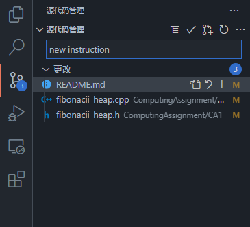

# CS225

_Pay close attention to **academic integrity** issue! You may only take this as a reference_

#### 介绍
This respository is for Haowen Zheng, Yiheng Zhang, Wenpeng Zhang and Haoze Gao

#### 使用说明

1.  根据[生成ssh公钥](https://gitee.com/help/articles/4181)说明生成公钥，把公钥发给我(或者给自己的账户[添加个人公钥](https://gitee.com/profile/sshkeys)(待测试可行性))
2.  进入WSL环境并打开终端，`cd`到想要存放此仓库的地址下，例如`cd ~`
3.  在终端输入`git clone git@gitee.com:haoze-gao/cs225.git`
4.  在终端输入`git config user.name "(your name)"`, `git config user.email "(your email)"`以设置个人信息（方便别人查看代码段提交者信息）
5.  可安装git相关插件(例如Github Pull Requests and Issues, GitLens)后使用左侧工具栏的Source Control功能来进行pull, push等操作，也可用上学期Github基本使用方式来进行使用

#### Git相关指令的使用~
1.  在VSCode扩展中搜索*GitHub Pull Requests and Issues*，点击安装
2.  安装完成后左侧工具栏应该会出现名为*源代码管理*的选项，如果检测到`.git`的配置文件（在完成上述使用说明后就会自动生成）此处会出现git相关操作以及产生变动的文件
    建议在VSCode的`文件-打开文件夹..`中选择`cs225`（即`clone`下来的项目的根目录）文件夹，这样能保证*源代码管理*能够准确识别到项目
3.  如果对文件进行了修改，修改过的文件会显示在*更改*分类之下

    在文本框中输入comment，用文件名后的+号选择提交哪些更改，确认后点击✔提交，点击↻右侧的···选择*推送*选项即可！

> 使用ssh连接**无需注册Gitee账号**即可使用，公钥发送给别人不影响安全性，只需要保存好私钥即可

**That's it!** ╰(￣ω￣ｏ)

> 如果怀疑自己的编译器有点问题，可以尝试更新一下Ubuntu中的包，输入'sudo apt-get update'后输入'sudo apt-get upgrade'，根据提示进行操作

**下列方法是使用https进行连接的使用说明，更建议使用ssh连接**
1.  完成注册Gitee账户后，点击这个页面右上角的*克隆/下载*按钮，复制HTTPS选项下的URL地址
2.  进入WSL环境并打开终端，`cd`到想要存放此仓库的地址下，例如`cd ~`
3.  在终端输入`git clone https://gitee.com/haoze-gao/cs225.git`
4.  在跳出来的顶部输入框中根据提示输入Gitee用户名及密码，等待git clone操作完成
5.  在终端输入`git config user.name "(your name)"`, `git config user.email "(your email)"`以设置个人信息（方便别人查看代码段提交者信息）
6.  可安装git相关插件(例如Github Pull Requests and Issues, GitLens)后使用左侧工具栏的Source Control功能来进行pull, push等操作，也可用上学期Github基本使用方式来进行使用

